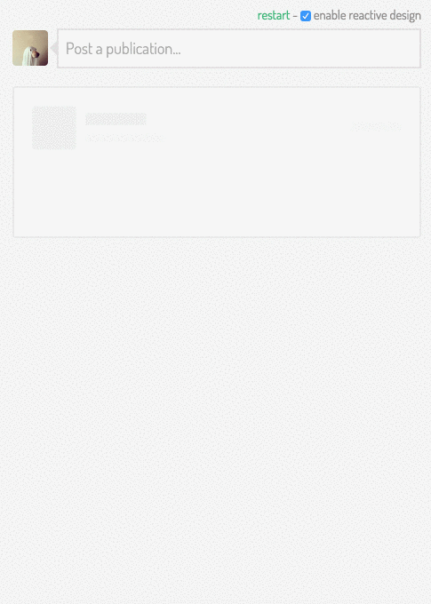

The purpose of this repository is to collect resources about design patterns that help improving perceived speed by designing reactive interfaces. The name is also a reference to [Reactive Systems](http://www.reactivemanifesto.org/).

*Please note that there is no relation between [The Reactive Manifesto](http://www.reactivemanifesto.org/) and this project at the time of writing.*

# Resources

* [The 3 White Lies Behind Instagram's Lightning Speed](http://www.fastcodesign.com/1669788/the-3-white-lies-behind-instagrams-lightning-speed)
* [UX Tactics To Make Slow Things Seem Faster](http://blog.placeit.net/ux-tactics-make-slow-things-seem-faster/)
* [Non-blocking UI's with interface previews](http://www.callumhart.com/blog/non-blocking-uis-with-interface-previews)
* [Facebook content placeholder deconstruction](http://cloudcannon.com/deconstructions/2014/11/15/facebook-content-placeholder-deconstruction.html)
* [Reactive Systems - The Reactive Manifesto](http://www.reactivemanifesto.org/)
* [Reactive Design implementation on Codepen](http://codepen.io/Zhouzi/full/ogdxJj/)
